indexmenu_n_4

== BR24 Radar

=== This plugin is obsolete. Please use Radar_pi v5.0 Radar_pi

+++_Radar PI replaces GRradar, GXRadar, and Navico Radar plugins for
OpenCPN ver 5.0 and up. This plugin overlays the radar picture on
OpenCPN. A versatile plugin that can be easily adapted to most broadband
radars. We will leave this documentation in place for about 4 months for
users of v4.8.8 and the dedicated Garmin plugin. by Kees Verruijt_+++

* Binary Release:
https://opencpn.org/OpenCPN/plugins/radarPI.html[Radar_pi 5.0 for
Windows & Mac, OpenCPN v5.0]
* Forum:
http://www.cruisersforum.com/forums/f134/radar-plugin-v5-0-0-released-216057.html[Radar
plugin v5.0.0 released]

=== OpenCPN radar plugin for Navico Broadband Radars

BR24 Radar requires OpenCPN 4.8.4 to Opencpn 4.8.8.

=== (BR24, 3G, 4G models)

BR24radar_pi is a plugin for http://www.opencpn.org[OpenCPN] that allows
full integration of Navico Simrad, Lowrance or B&G broadband radars. It
supports all broadband radomes – BR24, 3G and 4G.

The latest plugin version available is 2.1 which requires Opencpn 4.4.0
or later. The plugin requires also accelerated graphics OpenGL mode. It
does not work without OpenGL, and never will. This means that a computer
with good and fast OpenGL drivers is recommended.

Note: A new plugin version 3.0 is available on Github canboat
BR24radar_pi releases link below. Since that version needs a OpenCPN
update to be fully useable on Windows it's not yet available on the
OpenCPN plugins download page. An OpenCPN patch is though available on
the same Github release page. This wiki is therefor still mainly valid
for plugin version 2.1.

link:#basic_operation[BASIC OPERATION] +
link:#hardware_installation[HARDWARE INSTALLATION] +
link:#software_requirements[SOFTWARE REQUIREMENTS]

=== Links

* Binary releases: https://github.com/canboat/BR24radar_pi/releases +
* Binary releases:
http://opencpn.org/OpenCPN/plugins/navicoradar.html[OpenCPN Download
Navico Radar Plugin] +
* Source https://github.com/canboat/BR24radar_pi[Github BR24radar_pi] +
* Wiki(not up to
date):https://github.com/canboat/BR24radar_pi/wiki[BR24radar Wiki] +
* Manual:
https://opencpn.org/wiki/dokuwiki/doku.php?id=opencpn:opencpn_user_manual:plugins:ais_radar:br24_radar[BR24radar
Manual]
* Source: https://github.com/opencpn-radar-pi/radar_pi[Github
Repository- Beta Navionics/Halo/Garmin/GarminHx Radars] +
* Forum:
http://www.cruisersforum.com/forums/f134/navico-radar-plugin-v3-0-released-191536.html[Navico
Radar Plugin v3.0 Released] +
* Forum:
http://www.cruisersforum.com/forums/f134/opencpn-radar-overlay-plugin-79081.html[OpenCPN
Radar overlay plugin] +
The plugin can be operated as the only control station for your scanner,
as it allows access to all setup operations such as antenna direction
correction and antenna height, as well as cooperate in a multi-station
setup – whether multiple OpenCPN installations or one or more Navico
MFDs/plotters. In fact using a mixed setup is what 2 out of 3 developers
use, and recommend (our laptops and tablets don't work nearly as well
outside as the dedicated plotters.)

With the 4G model it supports dual range (“two radar”) mode, where both
radars can be operated individually (transmit state, gain & other
settings, guard zones, etc.) Compared to the plotters the only
functionality missing is MARPA but it has better _target trails_ support
than the plotters and comparable _guard zone_ support. It supports two
guard zones per radar as well as two _Electronic Bearing Lines_ (EBL)
and Variable Range Markers (VRM) per radar.

. link:#hardware_installation[Hardware installation]
. link:#software_requirements[Software installation]
. link:#basic_operation[Basic operation]
. link:#view_menu[Target trails]
. link:#ebl_vrm[Cursor, EBL and VRM]
. link:#guard_zone[Guard zones]
. link:#timed_transmit[Timed transmit]

=== Credits

The plugin was initially developed by Dave Cowell who took Dave
Register's Garmin plugin and modified it to work with the BR24. Over the
years code was contributed by @Hakansv, @douwefokkema, @seandepagnier,
@nohal, @chucksk, and @canboat.

=== BASIC OPERATION

link:#the_toolbar_button[The toolbar button] +
link:#the_context_menu[The context menu] +
link:#the_main_menu[The main menu] +
link:#full_main_control_menu_when_transmitting[Full main control menu
when transmitting] +
link:#adjust_menu[Adjust menu] +
link:#advanced_menu[Advanced menu] +
link:#preferences[Preferences] +
link:#view_menu[View menu] +
link:#guard_zone[Guard Zone] +
link:#timed_transmit[Timed Transmit] +
link:#ebl_vrm[EBL/VRM]

link:#hardware_installation[HARDWARE INSTALLATION] +
link:#software_requirements[SOFTWARE REQUIREMENTS] +
link:br24_radar/debugging.html[Installation trouble shooting] +
link:br24_radar/faq_radar.html[FAQ Frequently Asked Questions] +
link:br24_radar/traditional_radar.html[Traditional Radar Plotting
Methods]

==== The toolbar button

link:../../../manual/plugins/br24_radar/toolbar.png.detail.html[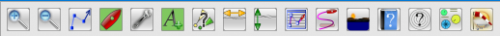] +
The toolbar button shows the state of the radar: +
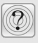=
Radar not detected
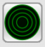=
Radar standby +
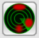=
Radar transmitting
=
Radar windows hidden

The action taken when clicking the icon depends on the current state:

* When radar overlay is enabled but the control menu is not shown it
shows the control menu.
* Otherwise it toggles the radar windows and overlay off (hidden) or on
(shown).

Hiding all radar windows and overlay is useful if you are sailing into a
highly complex situation where you want full view of the chart display
and not have the distraction of radar windows and paints over your
charts. The radar keeps its current settings (it keeps transmitting if
this was on) until you un-hide (show) it again.

==== The context menu

There are also two entries in the OpenCPN control menu for the radar
plugin. The context menu is usually accessed by clicking the right mouse
button on the chart window.

image:../../../https_3a_2f_2fraw.githubusercontent.com_2fcanboat_2fbr24radar_pi_2fmaster_2fwiki_2fradar_context_menu.png[image,width=171]

These are:

* Hide radar/Show radar
* Radar control

… Hide or Show radar should be self-explanatory. If chart overlay is
enabled the *Radar control…* button will show the control menu for that
radar only. If chart overlay is disabled it will show the control
menu(s) for one or two radars.

==== The PPI window(s)

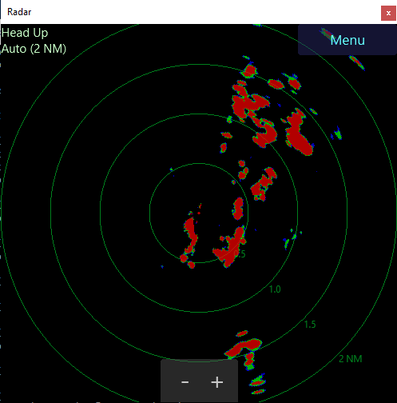

Either one or two classic radar displays, known as Position Plot
Indicators (PPI) by professionals, can be shown. You can hide these if
so desired (which makes sense only if you enabled the overlay over the
chart). You can resize, move or dock them into the chart display. To
close them you use the default OS button on the top of the window. To
dock them, drag them to the side or bottom of the chart window and wait
for a colored rectangle to be drawn over the chart.

The author likes to use two radar ranges with the windows docked on the
right side of the display, one above the other. But just try it out to
see what you like best.

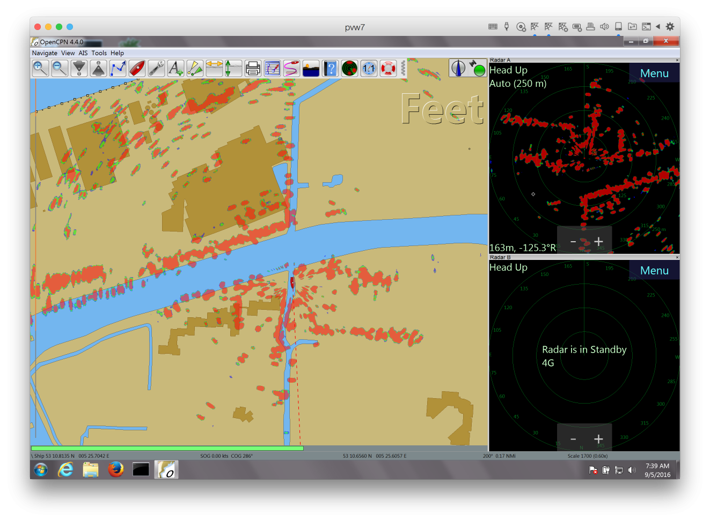

The PPI window has a *Menu* button that accesses the control menu. If
you moved the PPI window since the last time you accessed the control
menu the menu will come up immediately above the Menu button on the PPI
window.

==== The control menu

Every radar (again, in the case of a 4G you can have two) has its own
*control menu*. If radar overlay is enabled and you have hidden the
control menu of the radar assigned to radar overlay, press the toolbar
icon to access the control menu. If all else fails you can access this
using the context menu on the chart display (_Right mouse button > Radar
control …_) The control menu only shows those options which are
functional for the particular state of the radar, and has various
sub-menus.

==== The main menu

When the radar is not transmitting the menu looks like this:

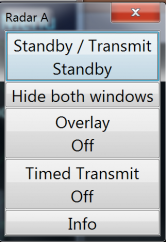

[.np_break]# #

[cols=",,",]
|===
|*Button* |*Possible Values* |*Purpose*

|Standby/Transmit/Standby |Standby, Transmit |Toggle radar Transmit
state

|Show/Hide Window |Show window(s), Hide window(s), Show other window
|Show or hide the PPI windows

|Overlay |Off, On, Radar A, Radar B |Toggles radar overlay over chart

|Timed Transmit |Off, mins |Chooses time that radar is in standby and
then automatically transmits again

|Info | |Show information dialog
|===

[.np_break]# #

==== Full main control menu when transmitting

When the radar is transmitting the menu looks like this: +
Most control menu text will change value according to actual status.
Some are buttons for further settings. Click a button to change the menu
for additional settings. The picture shows how each button calls for
detailed menus.

link:../../../manual/plugins/br24_radar/menublocks.png.detail.html[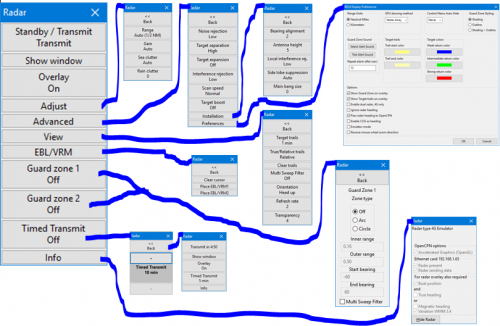]

[.np_break]# #

[cols=",,",]
|===
|*Button* |*Possible Values* |*Purpose*

|Standby/Transmit |Standby, Transmit |Toggle radar Transmit state

|Show Window |Show window(s), Hide window(s), Show other window |Show or
hide the PPI window(s)

|Overlay |Off, On, Radar A, Radar B |Toggles radar overlay over chart

|link:#adjust_menu[Adjust] |Adjust |Change menu to adjust range, gain
and clutter

|link:#advanced_menu[Advanced] |Advanced |Change menu to advanced
preferences

|link:#view_menu[View] |View |Change menu to adjust appearance
preferences

|link:#ebl_vrm[EBL/VRM] | |Set/Reset EBM and WRM in PPI window(s)

|link:#guard_zone[Guard zone 1] |Arc/Circle-On/Off |Change menu to
adjust guard zone 1

|link:#guard_zone[Guard zone 2] |Arc/Circle-On/Off |Change menu to
adjust guard zone 2

|link:#timed_transmit[Timed Transmit] |Off / xx mins |Change menu to set
timed transmit

|link:#enabling_the_plugin[Info] | |Show connection and other info
|===

[.np_break]# #

==== Adjust menu

link:../../../manual/plugins/br24_radar/adjust_menu.png.detail.html[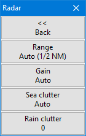]

* *Back* Return to previous menu.
* *Range* Set Auto and the range is adjusted to cover the chart screen
and will change according to OCPN zoom level. Or set a manual range.
* *Gain* Set Auto and the radar built-in method will adjust to “best”
performance. Or adjust manually.
* *Sea clutter* Set Auto and the radar built-in method will adjust to
“best” performance. Or adjust manually.
* *Rain clutter* Adjust manually to a suitable level when needed. A zero
value is for normal use. When heavy rain clutters the screen increase
the value to best performance. A to high value may also filter out
important targets.

==== Advanced menu

link:../../../manual/plugins/br24_radar/advanced_menu.png.detail.html[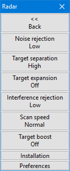]

Most of these menu items are buttons opening an adjustment box where a
click on “+” or “-” will adjust the value.

* *Noise rejection* Off-Low-High. Filter out noise what's not rain or
sea clutter.
* *Target separation* Off-Low-Medium-High. Let the radar try to
distinguish between targets
* *Target expansion* Off-On. Let the radar expand targets.
* *Interference rejection* Off-Low-Medium-High. Suppress interference
from other broadband (close) radars.
* *Scan speed* Normal-Fast. Set the rotation speed of the radar scanner
for example to follow high speed targets.
* *Target boost* Off-Low-High. Let the radar make targets bigger - more
“blobs” for each echo.
* *Installation* Set installation preferences like heading offset and
radar hight above water surface.
* *Preferences* While radar is transmitting the preferences menu can be
reached here from the control menu. The other patch is from OCPN Tools >
Options > Plugins > BR24 Radar > Preferences.

 +

==== Preferences

link:../../../manual/plugins/br24_radar/preferences_menu.png.detail.html[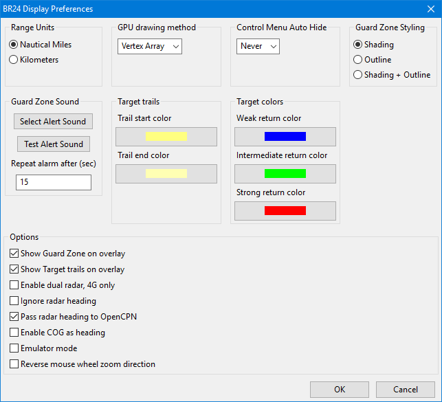]

*Options*

* *Show Guard Zone on overlay*: When set guard zones are drawn over the
charts. Otherwise only in the PPI window. Styled as of the upper right
settings.
* *Show Target trails on overlay*: When set trails are drawn over the
charts. Otherwise only in the PPI window. Fill colors as of the upper
settings.
* *Enable Dual radars*: If a 4G radar type is connected two PPI windows
can be shown. Each view will then get its own control menu.
* *Ignore radar heading*: In case a compass heading is connected to both
OCPN and the radar this option sets which of them the plugin will use.
* *Pass radar heading to OpenCPN*: In the case the radar has a compass
heading connected that signal will be passed from the plugin to OpenCPN
if set.
* *Enable COG as heading*: In the case no compass heading is available
the GPS course over ground, COG, can exceptionally be used. The radar
view will often be misdirected and can lead to insecure
misinterpretations.
* *Emulator mode*: A tool to test the function of the plugin. A dummy
radar image will be shown. Many control menus are not functional.
* *Reverse mouse wheel zoom direction*: Reverse the wheel zoom function
in the PPI window(s).

==== View menu

link:../../../manual/plugins/br24_radar/view_menu.png.detail.html[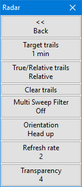]

* *Target trails* Click to open an edit box to increase/decrease the
trails length in time. Increase down to “Off” will switch trails off.
The color of the trails can be set in link:#preferences[preferences]
where also options for where to show trails, PPI/chart overlay, are
present.
* *True/Relative trails* Click to toggle between True/Relative. True
will obviously show trails from positions where the target has been.
Relative will show target movements relative your own ship during the
stated time; A target in front you at the same speed and heading will
though get no trail. If you are running faster the trail will show a
target moving towards yourself. Also static targets like marks and shore
will get a trail since relative your ship they are moving opposite your
heading. Try it! Sometimes it's very informative, sometimes disturbing.
* *Clear trails* Click the button to immediately clear all trails. If
trails are not set to “Off” all trails will restart.
* *Multi sweep filter* Click the button to toggle between Off/On. When
“On” a guard zone alarm will not be detected until several radar sweeps
have seen a target at the same position. Can be useful where waves are
high. But use it with care! The filter can also make small targets not
alarming.
* *Orientation* Click the button to toggle between Head up/North up in
the PPI window. For chart overlay OCPN's own settings are valid also for
the radar picture.
* *Refresh rate* Click to open an edit box to increase/decrease the
refresh rate. I high value will increase screen update time for the
radar picture. Fast targets will be shown without interruptions. A high
level will use significant more CPU. Two is default.
* *Transparency* Click to open an edit box to increase/decrease the
radar overlay transparency. A low value will cover what's on the chart,
a very high value is hardly visible. Five is default.

==== EBL/VRM

link:../../../manual/plugins/br24_radar/eblmenu.png.detail.html[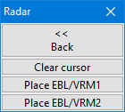]

* To set EBLs in a PPI window you first click a cursor mark to point out
an angle from centrum for the line.
* *Clear cursor* is used to clear any cursor mark in the window.
* *Place/Clear EBL/WRM 1* When this button is clicked a line will be
drawn from centrum and trough your cursor mark. When drawn the button
will change so you clear the line when desired.
* *Place/Clear EBL/WRM 2* Equal functions but for the second EBL/WRM.
Before setting the second line you have to make a new cursor mark for
the that line.

==== Guard zone

link:../../../manual/plugins/br24_radar/guardzonealert.png.detail.html[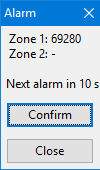]link:../../../manual/plugins/br24_radar/guardzonemenu.png.detail.html[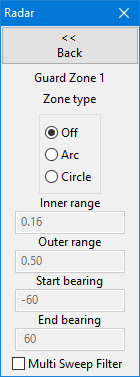]

 +
 +
*Guard zone 1 / 2* You can use two guard zone simultaneously and
independent of each others. Guard zone menu 1 and 2 are used to set
properties for each of them. Both menus are equal. Each zone is
indicated on the chart overlay and/or in the PPI window. The style can
be outlined and/or shaded. Once a guard alert is activated by a target
inside a zone an alert box is shown and the alert sound will play. Zone
style and sound to play are all set in link:#preferences[Preferences]. +
Once a guard zone alert is active the alert box is shown. In the message
box it's indicated which zone is alarming and the strength of the target
echo. The alarm is sounding repeatably and a count down timer will
indicate next alarm. The alarm sound can be silenced by the *Confirm* or
*Close* buttons. The close button will also hide the alert box. Both
confirm and close actions are valid for one target. If another target
appears inside a zone but at another range and bearing as earlier
confirmed a new alert will occur.

* *Zone type* The guard can be “Off” or on and shaped as an arc or a
circle.
* *Inner range* Enter the distance from own ship where the zone shall
start. Range units are set in link:#preferences[Preferences].
* *Outer range* Enter the range from own ship where the zone shall end.
* *Start and End bearing* If the zone is set to a circle these settings
are grayed out. For an arc enter start and end bearings. Zero is own
ships heading. Negative values can be used so one method to cover 40
degrees on each side in front of the boat is to set start to -40 and end
to 40. (Start at 320 and end at 40 will do as well.)
* *Multi sweep filter* Click to set the filter described in detail in
link:#view_menu[View menu].

 +

==== Timed transmit

link:../../../manual/plugins/br24_radar/timed_menu.png.detail.html[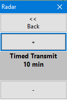]

link:../../../manual/plugins/br24_radar/timed_paused.png.detail.html[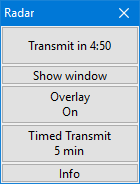]

* *Timed transmit* can be used to repeatably pause the radar
transmission for a chosen time. Use the “+” / “-” buttons to change the
time in five minutes steps. Decreasing to “Off” will deactivate the
function. Guard zone(s) to monitor during transmit periods has to be set
before the timed transmit function is activated.
* *Back* Once a time is set the function will initiate when the “back”
button is clicked. The function will start with a transmit cycle.
* *Function* While Timed Transmit is pausing the control menu will
inform it's status. The count down timer show remaining time till
transmission. Expired timer will start the radar for two minutes and
then return to a new pause. During transmit a count down timer indicates
remaining time to next pause.
* *Timed transmit reset* The timed function will reset if:
** A guard zone alert is detected during the transmit period.
** A user mouse click on either the timer count down button or
** A click on the Timed transmit button and decrease the timer value to
“Off”.

_Advanced:_ To change default transmit time after the pause change
“BR24Radar/RunTimeOnIdle=120” in OpenCPN

image:../../../lib/images/smileys/fixme.gif[FIXME] This is trying to
make a new page I think it is not going anywhere.
[[#configuration_file|configuration file.]]

=== HARDWARE INSTALLATION

link:#ri10_11[RI10/11] +
link:#shared_setup_with_a_navico_mfd[Shared setup with a Navico MFD] +
link:#installation_with_only_a_scanner[Installation_with_only_a_Scanner] +
link:#choosing_an_ethernet_switch[Choosing an Ethernet switch] +
link:#wifi[WiFi] +
link:#radar_interface_ri10_to_chartplotter[Radar Interface (RI10) to
Chartplotter] +
link:#radar_interface_ri10_to_radar_scanner[Radar Interface (RI10) to
Radar Scanner] +
link:#basic_operation[BASIC OPERATION] +
link:#software_requirements[SOFTWARE REQUIREMENTS] +
The Navico radars are very easy to use with OpenCPN. All you need is a
wired Ethernet connection.

Read your Navico/Simrad/Lowrance BR24/3G/4G installation manual for
schematic pictures corresponding to below descriptions. Also power
connections and patch cable pin outs, when needed, are well described in
the manuals.

You can add as many computers as desired, the system will allow
operation from all connected MFDs (plotters) and computers.

==== RI10/11

In all installation packages (except Lowrance 3G USA) the scanner also
ships with a small black box – either a RI10 with NMEA 2000 input or a
RI11 with NMEA 0183. It uses the data from the heading sensor on the
NMEA network to add this to the radar data.

* The Navico plotters require heading input to the RI-10/11 for MARPA
operation.
* The plugin uses this heading as the “best” source of heading for radar
overlay.

This box also helps isolating the system electrically, and will improve
protection of the computer from damage in case of electrical storms
(lightning.)

==== Shared setup with a Navico MFD

If you already have a Navico MFD installed the installation consists of:

* Installing an Ethernet switch, or a WiFi router with a built in
Ethernet switch. You need a wired port for each device – the radar, the
MFD(s) and the computer running OpenCPN.
* Connect all devices to the switch.

_In all cases you will need at least one RJ45 to Navico radar connector
cable_. The cheapest solution is to cut Navico Ethernet cables with two
yellow connectors at both ends, and crimp a RJ45 connector onto both
halves. Or get a standard Ethernet patch cable. So for the most common
case where you have a single MFD connected to a radar scanner:

* Cut the Ethernet cable between MFD and scanner and crimp on two RJ45
connectors.
* OR - Get another Ethernet patch cable, preferably shielded, STP. (Cat5
or Cat6 will both work.)
* Insert these into a switch.
* Connect the computer to the switch as well.

Alternative to cutting into the Radar Ethernet Cable, see wifi below.

==== Installation with only a scanner.

If your scanner came with a RI10:

* Cut the supplied Navico ethernet cable in half or get another Ethernet
patch cable as of above paragraph.
* Crimp on a RJ45 connector.
* Insert the RJ45 connector into the computer's Ethernet port or a
standard Ethernet switch and the other side into the RI10.

Install the scanner as detailed in the Navico installation instructions.
_The same instruction also contains RJ45 cable pin out scheme._

If you bought a USA Lowrance 3G scanner:

* Insert the RJ45 connector from the radar scanner into a standard 100
Mbit switch. _or_
* Cut the supplied Navico conversion cable that has a RJ45 female
connector and a yellow Navico connector in half, and replace the yellow
connector with a RJ45 connector.

We recommend _always using a 100 Mbit switch in this setup_ to provide
some electrical isolation between the scanner and the computer. We don't
know whether the connection between the radar and the RI10 uses the four
other wires for some non-Ethernet purposes, so some damage may occur if
you insert the radar cable directly into your computer.

==== Choosing an Ethernet switch

If you are going to use a switch you may as well use a Gigabit switch.
The scanner has a 100 Mbit interface, but a Gigabit switch will use
slightly less power than a 100 MBit switch. You should probably also use
one that has a 12V input which can be powered directly from the 12V
house battery (or a DC/DC converter if you have a 24 V house battery
bank.)

The author uses a 5 port Netgear GS105 which according to Netgear:
_+++Both GS105 and GS108 support the latest Energy Efficient Ethernet
(IEEE 802.3az) standard, which reduces energy consumption when there is
light traffic on an active port or when there is no link or no activity
detected. It can further save energy when a short cable (<100m) is used.
Energy savings lead directly to cost savings in operation.+++_

Note: make sure you get the _metal cased_ GS105/GS108 that uses 12 V
input. There are now also other models with a plastic case that have a 5
V input, which requires an extra DC/DC converter.

==== WiFi

The _multicast_ transmission system used by the scanner means that
transmission over WiFi must happen at the lowest rate that any device
connected to the WiFi network is capable of. For 802.11b and g this rate
is 1 Mbit/s. Since the radar data is ~ 1 Mbit/s as well this means it
+++does not work well at all+++. The solution is to either:

* Modify the base rate to be higher. This reduces the maximum range of
your WiFi network for all devices.
* Get a faster WiFi network, for example 802.11a or 802.1ac (5 GHz).
This has a much faster base rate (6 Mbit/s). Unfortunately, most WiFi
routers do not allow you to change the base rate. If yours is Linux
based and uses 'hostapd' you can edit the following section in
'hostapd.conf'. The example disables basic rates 10 and 20 (= 1 and 2
Mbit/s):

_# Basic rate set configuration +
# List of rates (in 100 kbps) that are included in the basic rate set. +
# If this item is not included, usually reasonable default set is
used. +
#basic_rates=10 20 +
#basic_rates=10 20 55 110 +
#basic_rates=55 110 +
#basic_rates=60 120 240_

===== B&G or Simrad Go-Free Wifi

One alternative to cutting into the Ethernet Cable See
http://www.cruisersforum.com/forums/f134/navico-radar-plugin-beta-3-816-released-189342.html#post2472857[Cruiser
Forum Post by EJS in Navico Radar Thread] He enabled multicast and made
sure he had no slow devices affecting the data stream.

* I am using a GoFree WiFi to transmit halo radar data to a PC running
openCPN quite successfully. It has not been slow at all (No missing
radar spokes with both ranges running) after I enabled the multicast
mode in the GoFree router. Based on the info in the advanced set-up
guide from Simrad, multicast is disabled by default to keep the radar
data from clogging the GoFree bandwidth in case you have many devices
using the router. Since the radar data is really what I want, I enabled
multicast and the radar data passes through at high speed. I have also
made sure there are no slow WiFi devices on the net as the router
defaults to the slowest transmission rate of any connected device.

* My GoFree is hardwired to the radar control box, and hardwired to the
chart plotter, but is wireless to the OpenCPN PC (Windows 10, 802.11N)
The usual connection is to hardwire directly from the radar box to the
chartplotter, but the GoFree passes the traffic correctly (as it should)
I can control the radar from either the PC or the chartplotter. The
display changes on both displays when I make a change on either one. I
see no reason the set-up shouldn't work with the other Simrad radars and
other Wifi Routers as long as multicast can be enabled.

For additional IP connection help see:
link:br24_radar/debugging.html[Radar Debugging] Additionally, please
review the various capabilities of a Go-Free network which is dependent
on your chartplotter hardware.
http://yachtelectronics.blogspot.com/[Navico's GoFree -- 2015 update by
Kees Verruijt]

==== Radar Interface (RI10) to Chartplotter

===== Cables and RJ45 Ethernet Pinouts

*This Ethernet cable runs from the RI10 Radar Interface to the back of
the Chartplotter.* This cable is cut and wired with two new RJ45
Connectors for a link:#choosing_an_ethernet_switch[Ethernet Switch] or
link:#wifi[Wifi Router]. to be inserted in between the cut ends with new
RJ45 connectors, with both the chartplotter and the RI10 connected.

Standard T568 Ethernet Connections

There are two T568 Standard Connections
http://www.incentre.net/wp-content/uploads/2015/02/ethcable568b.gif[T568B]
and http://pinouts.ru/visual/ethernet_10_100_1000.jpg[T568A]. Normally
when wiring ethernet, you may use either. For more information about
http://pinouts.ru/NetworkCables/Ethernet10BaseTStraightThru_pinout.shtml[Ethernet10BaseT
Straight Thru Pinouts]

Note that the radar may not use either of these standard connections,
and depending on the manufacturer, B&G, Simrad or Lowrange the cable
colors and pinouts being used may differ from this standard.

The RJ45 connector has 8 pins, but for normal use is 4 enough because
the radar only uses 100mb ethernet. B&G and Simrad have 4 wires: Blue,
blue/white, orange, orange/white. Lowrange may be slightly different.

link:../../../manual/plugins/br24_radar/b_g_4-wire_cable.jpg.detail.html[image:../../../manual/plugins/br24_radar/b_g_4-wire_cable.jpeg[B&G
Typical 4 Wire Cable,title="B&G Typical 4 Wire Cable",width=300]]

B&G Typical 4 Wire Cable

link:../../../manual/plugins/br24_radar/b_g_ethernet-wires-connected.jpg.detail.html[image:../../../manual/plugins/br24_radar/b_g_ethernet-wires-connected.jpeg[B&G
RJ45 Connection of the 4 Ethernet
Wires,title="B&G RJ45 Connection of the 4 Ethernet Wires",width=400]]

B&G Typical RJ45 Connection of the 4 Ethernet Wires

What I found is that the cabling and pinout is actually *_neither_*
T568A or T568B standard. With the clip pointed away & the main wire
coming from the right, my pin numbering is as follows. *You should check
your RJ45 connector wiring carefully.*

[source,code]
----
  Not Used ------ Pin 8  |
  Not Used ------ Pin 7  |
  Orange -------- Pin 6  |
  Not Used ------ Pin 5  |=========== Main Cable
  Not Used ------ Pin 4  |
  OrangeWhite --- Pin 3  |
  Blue ---------- Pin 2  |
  BlueWhite ----- Pin 1  |
----

B&G Typical Ethernet Cabling Chart with numbers.

link:../../../manual/plugins/br24_radar/b_g_ethernet_cables.jpg.detail.html[image:../../../manual/plugins/br24_radar/b_g_ethernet_cables.jpeg[B&G
Typical Ethernet Cabling
Chart,title="B&G Typical Ethernet Cabling Chart",width=500]]

With these Typical Round 5 Pin Male Cable Ends

link:../../../manual/plugins/radar_overlay_ais/b_g_5-pin-male-cable-end.jpg.detail.html[image:../../../manual/plugins/radar_overlay_ais/b_g_5-pin-male-cable-end.jpeg[Typical
Round 5 Pin Male Cable
End,title="Typical Round 5 Pin Male Cable End",width=300]]

B&G 000-0127-51 Ethernet cable 6.5' (various lengths are available) with
two Round 5-pin Male Cable Ends. *This Ethernet cable runs from the RI10
Radar Interface to the back of the Chartplotter.* This is cut and wired
with 2 new RJ45 Connectors for a
link:#choosing_an_ethernet_switch[Ethernet Switch] or link:#wifi[Wifi
Router].

link:../../../manual/plugins/br24_radar/b_g_lowrance_ethernet_cable_000-0127-51.jpg.detail.html[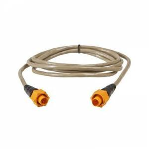]

B&G 000-0127-56 Ethernet Round 5-Pin Male to RJ45 Cable -Instead of
cutting the cable ($60-$70).
link:../../../manual/plugins/br24_radar/b_g_s-l1600.jpg.detail.html[image:../../../manual/plugins/br24_radar/b_g_s-l1600.jpeg[B&G
Circular Male 5 Pin to Ethernet
Cable,title="B&G Circular Male 5 Pin to Ethernet Cable",width=300]]

B&G GoFree Wifi Female Ethernet Connectors (B&G Chartplotters with
Nmea2000 use same connectors)

link:../../../manual/plugins/br24_radar/b_g_gofree_ethernet_5-pin_circular_female_socket.jpg.detail.html[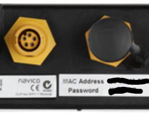]

Comparison of B&G EtherCAN and Canbus

link:../../../manual/plugins/br24_radar/b_g_m12_4-pin_ethercat_and_m12_5-pin_canopen.jpg.detail.html[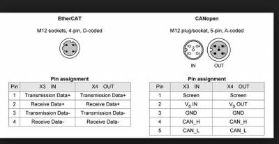]

==== Radar Interface (RI10) to Radar Scanner

link:../../../manual/plugins/br24_radar/b_g-ri10_box--2-radar-rj45ethernet_power.jpg.detail.html[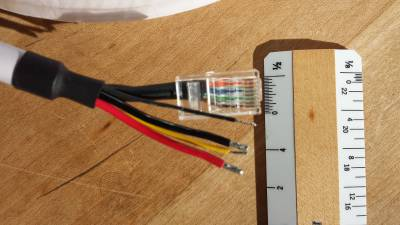]

https://bandg.com/downloads/broadband-radar-34g-install-guide/[B&G
Broadband Radar 3G / 4G Install Guide]

B&G RJ45 Ethernet Connection (See above)

* Note that this connection uses all 8 Wires *_but_* we do not know
which T568 Standard!
* *_You will have to inspect your Radar Cable's Ethernet connector to
determine the pin outs._*
* Also refer to page 12 & 13 of the Radar Installation.
+
[source,code]
----
 8 Brown -------|
 7 White/Brown -|
 6 Green -------|
 5 White/Blue --| ============= Ethernet wire
 4 Blue --------|
 3 White/Green--|
 2 Orange-------|
 1 White/Orange-|
----

Then there are additional wires exclusive of the Ethernet RJ45
connection.

* Thin Black = Shield
* Heavier Black = Neutral
* Thin Yellow = Turns on and off Radar
* Heavier Red = Positive Power

If you need to cut the Radar Cable for some reason, for example to
remove it in the winter, you can fashion a watertight box with a 4 wire
strip connector and (2)RJ45's with a straight RJ45 Connector. You will
also need to determine how you want to turn on the Radar, via the yellow
wire (from the Chartplotter or independently or when the Radar has
power? There are instructions in the manual.) Also there are
https://www.digikey.com/en/product-highlight/a/amphenol-commercial-products/harsh-environment[Amphenol
MRJ Rugged RJ45 Connectors] available with matching terminals.

The scanner interconnection Diagram and pinouts are on page 34, but you
are unlikely to need them.

=== SOFTWARE REQUIREMENTS

link:#network_setup[Network Setup] +
link:#installing_the_plugin[Installing the plugin] +
link:#enabling_the_plugin[Enabling the plugin]

link:#basic_operation[BASIC OPERATION] +
link:#hardware_installation[HARDWARE INSTALLATION] +
link:br24_radar/debugging.html[Trouble shooting if below not works]

The plugin requires the following software requirements:

* OpenCPN 4.2 or higher installed. Generally the latest production
release is recommended, at the time of writing this is OpenCPN 4.4.
* Firewall disabled or with exceptions enabled for opencpn.exe.
* OpenGL mode enabled in OpenCPN. The frequent screen updates produced
by a radar make traditional window calls impractical.

==== Network setup

The scanner and the displays communicate using a system called
_multicast_. This has the advantage that the data only needs to be sent
once, and is received by all displays. Uniquely, it also means that
there is no issue with Ethernet addresses. _Any ethernet address is
acceptable._ A disadvantage is that it can be hard to setup a firewall
rule as you don't just “open” a particular port. The simplest solution
is to allow `opencpn.exe` full access to the network for both receive
and transmit.

==== Installing the plugin

Download the latest production version and run the installation package.

* Microsoft Windows and macOS releases are available from the [release
page on this site](https://github.com/canboat/BR24radar_pi/releases).
* Linux (apt): see the [standard
instructions](http://opencpn.org/ocpn/download) for installing OpenCPN
on Linux. The plugin package name is 'opencpn-plugin-br24radar'.

==== Enabling the plugin

* Start OpenCPN
* Go to Options > Plugins > BR24radar. Click *Enable*.
* Close the options dialog. You now have a new icon in the toolbar.

If the radar has not been detected yet it will show as:

and if the radar has been detected it will show:

There is also an information window that shows whether the scanner has
been detected, and whether there is a valid heading input:

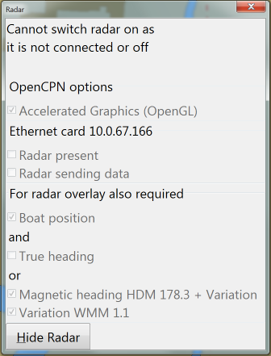

If a condition is not satisfied this dialog will open automatically. You
can also open it using the control menu (see next page.) As you can see
the Info dialog shows whether you have OpenGL mode enabled.

It also shows whether radar presence has been detected, and its IP
address. Until it has it will cycle through all Ethernet cards at the
rate of one card every two seconds. In the image above the scanner has
not been seen yet and it is listening on the card with IP address
10.0.67.166.

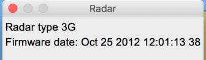

In the above image the radar type and firmware release date are shown,
this shows that the radar has been detected successfully.

For *North Up* display and radar overlay you must have a heading sensor
attached, either via the RI10/11 (preferred) or via NMEA0183 input to
OpenCPN directly. If you use a magnetic sensor the variation is also
required, but that is easy to do by enabling the WMM plugin.

For radar overlay you must have a boat position via GNSS input to
OpenCPN. The most common is a GPS sensor sending NMEA0183 data.

By customer demand it has been made possible to use Course Over Ground
as the heading input, but we think this is such a bad idea that we have
not enabled it by default. Go to the __Options > Plugins > BR24radar >
link:#preferences[Preferences] page to enable it. Please don't enable it
and then complain that the overlay is out when you are going slowly or
are docked.

 +
