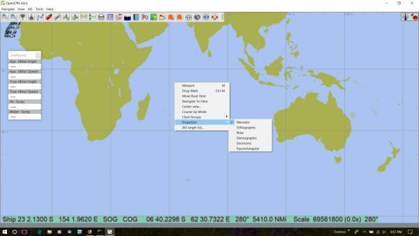
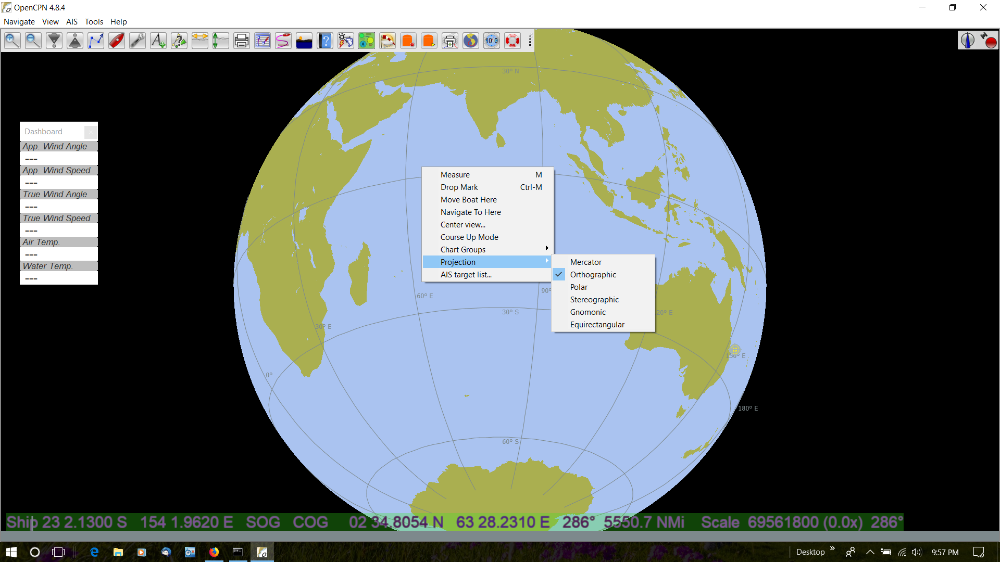
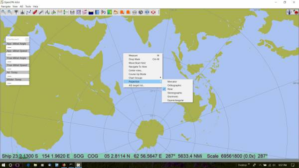
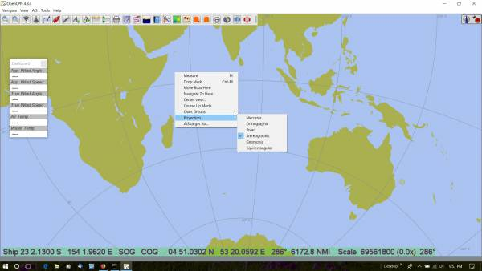
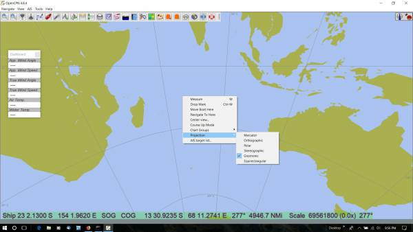
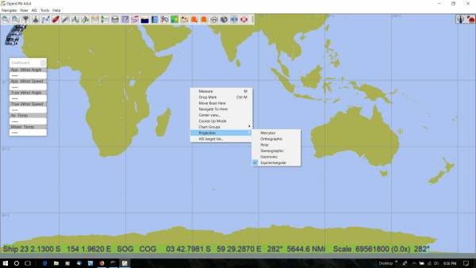

indexmenu_n_11

== Projections

=== Links

* Source: https://github.com/seandepagnier/projections_pi
* Downloads: https://opencpn.org/OpenCPN/plugins/projections.html
* Forum:
http://www.cruisersforum.com/forums/showthread.php?p=2633744[Projections_pi
Thread]
* YouTube: https://www.youtube.com/watch?v=NrM6dMi0UbI[Projections]

=== How to set the Projection

Right click anywhere on the chart and pick the Projection from the list
available. +
 +
Mercator Projection +
link:../../../manual/plugins/1-mercator.jpg.detail.html[] +
 +
Orthographic Projection +
link:../../../manual/plugins/2-orthographic.png.detail.html[] +
 +
Polar Projection +
link:../../../manual/plugins/3-polar.jpg.detail.html[] +
 +
Stereogrphic Projection +
link:../../../manual/plugins/4-stereographic.jpg.detail.html[] +
 +
Gnomonic Projection +
link:../../../manual/plugins/5-gnomonic.jpg.detail.html[] +
 +
Equirectangular Projection +
link:../../../manual/plugins/6-equirectangular.jpg.detail.html[]
