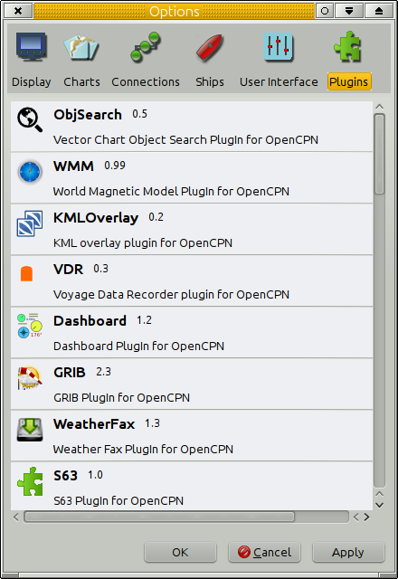
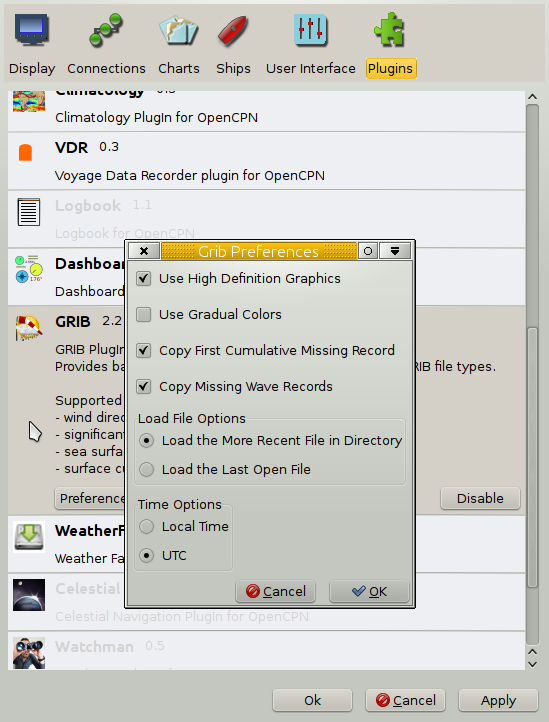
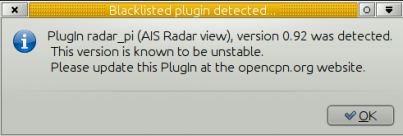

indexmenu_n_1

== Install, Enable & Uninstall

The core OpenCPN tries to keep features to a minimum so that it is lean,
mean and easy to use. Features can still be added through the plugin
infrastructure. Both the older Plugin Package Installation (PI) and the
Package Manager (PM) are supported by Opencpn v5.2.4.

=== Plugin Package Installation & Removal (PI)

* Plugin Package Installation (PI) is the older more familar manual
process.
* Packaged Plugin executable ( (*.exe, *.deb, *.pkg, *.dmg) Installers
are “manually” downloaded and installed and manually removed.
* In OpenCPN Options > Plugins the “Manual Uninstall” button will be
greyed out fot these types of plugins because they must be “manually”
uninstalled or removed.
* Release of OpenCPN 4.2 upgrades the user framework for Plugins to a
newer version, which means it is not binary compatible with the previous
releases and all Plugins for Windows, Linux and MacOS must be rebuilt
for compatibility. Plugins compiled for v4.2 will work in Opencpn v5.0.
* Current Plugin Packages normally have “ov50” in the filename
indicating compatiblity with Opencpn v5.0 forward.
* Current Plugin Packages will NOT have the *Uninstall* button “enabled”
in Options > Plugins, therefore these Plugin Package Installations must
be removed as they were installed, “manually” with the details dependent
on the Operating System.

=== Plugin Manager (PM)

The release of OpenCPN 5.x includes the new *Plugin Manager (PM)*
(Options > Plugins > “+” ) which permits user selection of plugins for
Installation via the internet from Cloud sources and Plugin Management
(update, reinstallation and removal). This new system is different from
the earlier manually installed *Plugin Packages Installer (PI)*, and
will only “Uninstall” it's own kind of plugin.

=== PI and PM Plugin Use

Below are some suggestions for using these two plugin installation
systems. OpenCPN is moving to the (PM) system as quickly as possible and
has prioritized that:

* PI =Plugin Package Installer: Plugin installed the “old fashioned way”
(uses exe, deb, pkg).
* PM =Plugin Manager: Plugin installed by the Plugin manager
automatically within the interface (uses 'tarballs').
* Both types of plugin installations installations are supported.
* PI and PM Plugins are installed in different directories. See Where
are my Plugins installed? below.
* PI Plugins can be installed at the PI directory, while the same plugin
is installed by the Plugin Manager.
* OpenCPN will prioritize the PM plugin if both are present.

So, if you want to use the Plugin Package Installer (PI) plugin instead:

* Uninstall the (PM) Plugin Manager version at _Options→Plugins_.
* Notice the (PI) version designation will be like '_5.1_' (two digits)
* While a (PM) version will have also the patch designation like:
'_5.1.4_' (three digits)

When you want to return to a PM version do update the plugin catalog and
install it.

Please refer to link:install_and_enable.html#plugin_versions[Plugin
Versions] below.

=== Default Plugins

Pre Installed Plugins

link:included_plugins/grib_weather.html[grib_weather] +
link:included_plugins/dashboard.html[dashboard] +
link:included_plugins/wmm.html[WMM Plugin] +
link:included_plugins/chart_downloader.html[chart_downloader]

=== Plugin Types (PI) and (PM)

*Default Plugins, Plugin Package Installer (PI) and Plugin Manager (PM)
Types* can all exist in the _Options > Plugins_ menu, however the
manually installed _Plugin Packages_ (of a given name), must be manually
removed before a new _Plugin Manager_ version of the same name can be
installed. The installation process is very different for both types.
_Plugin Packages_ are useful for download with internet access and later
installation at sea. _Plugin Manager_ is more convenient and useful when
there is good internet access to cloud repositories. The user can
distinguish between these different _plugin types_ by the icon to the
right in the _Options > Plugins_ listing. There is a hover message which
also helps.

These newly rebuilt plugins will not work with older versions of
OpenCPN.

=== Plugin Packages (PI) - Manual Install & Uninstall

==== Download Plugin Package

Most plugins provide platform installation packages (*.exe, *.deb,
*.pkg, *.dmg) that allow the plugin to be installed by downloading the
package from various locations, the latest of which is cloudsmith. These
packages can be installed by 'running' them on the platform they are
intended for (this is indicated in the file name). This is also known as
a “Manual Installation of a “Packaged Plugin”.

Packaged Plugins are found primarily on the dedicated page
https://opencpn.org/OpenCPN/info/downloadplugins.html[OpenCPN Download
Plugins]

* Cloudsmith repositories also contain “Packaged Plugins”..
* Github repositories under the Release Tab for each Plugin Developer.
* For a complete list of plugins read the
http://www.cruisersforum.com/forums/f134/plugin-threads-list-100306.html#post1189427[recent
posts in this forum thread].

==== Linux Packages (*.deb or *.so)

===== Install

* Please refer to this page
link:install_linux_plugins.html[install_linux_plugins]
* You should be able to install from the main repository that you
installed OpenCPN from. This will use the standard installation process
your version of Linux uses.
* It is possible that you may be able to use a simple plugin by finding
the 'executable' file and placing the downloaded “pluginxx.so” in
\{prefix}/lib/opencpn, which means /usr/lib/opencpn for a standard
installation, using the provided packages. If you are compiling yourself
\{prefix} may be ”/usr/local“ instead of ”/usr“. Check “opencpn.log” if
necessary. However, if the plugin requires data, icons, etc. this will
leave a, probably, non-functional plugin on the system.

===== Uninstall and Remove

* Linux users can use yum (redhat based) or apt or dpkg (debian/ubuntu
base) command lines as well as the gui's, Synaptic Package Manger
(debian/ubuntu), gnome-software (redhat).

==== Windows Packages (*.exe)

===== Install

* The downloaded file is usually an executable ”.exe“ installation file.
Click on the file and follow the instructions. If the file is a “_.dll”
place the downloaded “pluginxx.dll” in a “plugins” sub folder of your
OpenCPN installation folder. A common location is C:\Program
Files\OpenCPN\plugins.
* Once the plugin is in the right directory, restart OpenCPN and proceed
to enabling the plugin.

===== Uninstall and Remove

* Using Administrative permission, navigate to *_C:\Program Files
(x86)\OpenCPN [Version Number]_* and execute the
*Uninstall-[Pluginname].exe* in that directory.
* Using Administrative permission, navigate to *_C:\Program Files
(x86)\OpenCPN [Version Number]\plugins_* and simply delete appropriate
*[pluginname].dll* file and *[pluginname]* subdirectory.
* Additionally, if you remove the dll and directory manually, without
using the uninstall.exe, you should open the *Opencpn.ini* file in the
_C:\ProgramData\opencpn_ directory with a text editor and search for
“plugins”, to find these lines
* [Plugins] - remove reference to the plugin.
* [PlugIns/[pluginname]_pi.dll] bEnabled=0 - Remove these lines.
* You will also find other lines with the plugin user settings, but
these can be left in place if you wish.
* Common Paths used by Opencpn Plugin Packages
** Dll and plugin subdirectory: C:\Program Files (x86)\OpenCPN [version
number]\plugins
** User Plugin Data: cd %programdata%/opencpn/plugins goes to
“C:\ProgramData\opencpn\plugins”.
** Also same directory as “C:\Users\All Users\opencpn\plugins”

==== MacOS Packages (*.pkg)

===== Install

* The plugin will come as a pkg file. Double-click the pkg file and
follow the install instructions. This will place the plugin files in the
proper locations.

===== Uninstall and Remove

* This is less clean, but this link shows how to uninstall macOS
sotware:
https://techsviewer.com/how-to-completely-uninstall-application-in-mac/

=== Plugin Manager (PM) Installation

Because the _Plugin Manager (PM)_ uses internet links and access to
cloud repositories and “Catalogs” or lists of available plugins, it
provides a more seamless user experience than the _Plugin Package (PI)
Installers_. The installation of the Plugin Manager (PI) is done
completely from within the Plugin Interface _Options > Plugins_.

Alec Leamas has provided an extensive
https://github.com/leamas/opencpn/wiki["Tentative" Manual for Plugin
Manager] which provides details about it's operations.

(We need screen shots and more description here.)

* + Menu to access the Plugin Manager list.
* Install
* Uninstall
* Reinstall
* Update Plugins Catalog
* Catalog Manager - Cancel, OK
* Advanced Catalog Update.
* Advanced Catalog Channel - Experimental, Alpha, Beta, Release
* Custom Catalog URL

==== 

=== Common

All plugins must be
link:install_and_enable.html#enabling_a_plugin[Enabled], can be Disabled
and when upgraded need to be
link:install_and_enable.html#re-enable_a_plugin_after_a_plugin_update[re-Enabled].
Also occassionally a plugin needs to have
link:install_and_enable.html#troubleshoot_problems[Troubleshooting],
more information about
link:install_and_enable.html#plugin_versions[Plugin Versions], also
link:install_and_enable.html#blacklisted_plugins[Blacklisted Plugins]

==== Enabling a Plugin

Plugins are made available by clicking on the plugin in the
Options→Plugins Tab. Once this is done, an “Enable” button appears.
Pressing this button activates the plugin icon in the ToolBar and
changes the the default “grayed out” text to black in the list. Not all
plugins have an icon when active. For most plugins there is a
“Preferences” Button for configuration.

When a plugin is disabled in the Options→Plugin tab, the plugin Icon
disappears from the ToolBar.

The Plugin Icon works as a toggle switch for the plugin. Pressing the
Grib Icon, for example, activates the Grib plugin. Pressing one more
time deactivates it.

The WMM Icon uses a new feature, by displaying the magnetic variation,
at the position of OwnShip in the button itself.

==== Re-Enable a Plugin after a Plugin Update

Version 4.2 has implemented automatic reload of updated PlugIns by
visiting the *Options→Plugins* screen.

Presumably the plugins are rescanned and loaded.

Previously, after a plugin was Disabled, the program had to be shut down
and reopened for the full change of Opencpn status to occur. This is no
longer necessary, simply go to the Option→Plugins screen and all plugins
will be reloaded.

==== Troubleshoot Problems

If you run into problems with plugins, first check what the opencpn.log
file says.

For each plugin you will find lines similar to:

[source,code]
----
    08:59:25 CEST: PlugInManager searching for PlugIns in location /usr/lib/opencpn\\
08:59:25 CEST: PlugInManager: Loading PlugIn: /usr/lib/opencpn/libweather_routing_pi.so\\
08:59:25 CEST: /usr/lib/opencpn/libweather_routing_pi.so\\
API Version detected: 110\\
PlugIn Version detected: 101
----

This example is from Linux.

On Windows systems the location of the log file will be displayed when
you click “Help” (the ? mark icon) on the toolbar. Alternatively, to
find the “opencpn.log” on your system read
link:../getting_started/opencpn_installation.html[opencpn_installation].

==== Plugin Versions

The release of OpenCPN 5.2.4 upgrades the user framework for Plugins to
a newer version *Plugin Manager (PM)* which uses new file formats (xml
metadata and tarball) and provides a more comprehensive installation
interface within _Options > Plugin._ The older *Plugin Package Installer
(PI)* framework is still supported (for transition)

The release of OpenCPN 4.2 upgrades the user frameworks for Plugins to a
newer version *Plugin Package Installer (PI)*, which means it is not
binary compatible with the previous releases and all Plugins for Windows
and Linux must be rebuilt for compatibility. It is expected that this
Plugin interface will remain stable for some time so Plugins will work
across different (future) versions of OpenCPN.

==== Where are PI and PM plugins installed?

With OpenCPN v5.2.4 the plugin system changed from Plugin Installer (PI)
“self-managed” to Plugin Manager (PM) “managed” inside _Options >
Plugins_

*Plugin Package Manager (PI)* - Older process

* Executable and Plugin Data: C:\Program Files (x86)\OpenCPN [version
number]\plugins (both Internal and External Plugins)
* User Plugin Data %programdata%/opencpn/plugins or C:\Users\All
Users\opencpn\plugins or C:\ProgramData\opencpn\plugins

*Plugin Manager (PM)* - Newer

* External Plugin User Executables and User Plugin Data
%LOCALAPPDATA%\opencpn\plugins (External Plugins only)
* or alternatively the same folder
C:\Users[User]\AppData\Local\opencpn\plugins
* Thus all 'External' Plugin executables and the plugin data are in a
user accessible folder.
* Internal Plugin dll remain at C:\Program Files (x86)\OpenCPN
5.2.4\plugins
* Data: C:\ProgramData\opencpn\plugins (same)

For further reference about the difference between
https://stackoverflow.com/questions/16276139/what-is-the-difference-between-programdata-and-appdata[ProgramData
and AppData]. Plugin Manager chooses to use the Users AppData
(%LOCALAPPDATA%) which is typical and better for a number of technical
reasons.

Above is for Windows, for other Operating Systems and more details
please read this documentation:
https://github.com/leamas/OpenCPN/wiki/Installation-pathspaths

*Default Internal Plugins*

* Executable and Data “C:\Program Files (x86)\OpenCPN [version]\plugins

*Cache -Metadata and Tarball*

Just to be complete, there is a cache file that stores all the Plugin
Manager (PM) tarballs that have been downloaded. These normally do not
have to be accessed or cleaned out. However some developers may find
that it is necessary to remove these files and start over if they are
working on the proper results in the Plugin Interface. For windows the
location is

* Metadata file: C:\ProgramData\opencpn\plugins\cache\metadata You will
find the ocpn-plugins.xml being used.
* Tarball files: C:\ProgramData\opencpn\plugins\cache\tarballs You will
find all tarballs that have been downloaded.

The tarball cache can build up, it is a resource for reinstallation, so
if you are at sea without internet don't remove these files.

==== Blacklisted Plugins

Plugins or versions of plugins known to be problematic can be
Blacklisted.

A dialog pops up for 5 seconds when starting OpenCPN, if a blacklisted
plugin is detected. This will happen even if the plugin is not enabled.
A number of plugins are blacklisted. They are, mainly, old problematic
versions of plugins. There is always a newer version of a blacklisted
plugin, or, in worst case scenario, one will soon be released.
