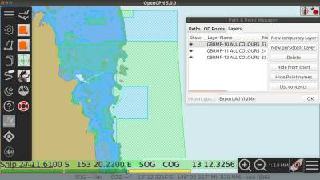
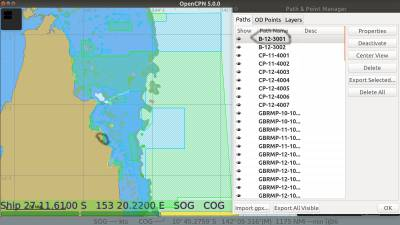

indexmenu_n_1

== QLD Coastal Zones

Github Repository: https://github.com/redog666/qld-coastal-zones[QLD
Coastal Zones - GPX files used in Ocpn_Draw Layers]

Dave, change this as you wish. See the first screenshot that I used
Media Manager to upload and then “inserted” into the text. The Editor's
Manual is here
link:../../../../developer_manual/edit_user_manual.html[edit_user_manual]
under Dev Manual. You will find an item about Media Manager that will be
helpful I hope.

=== Description

Ahoy OpenCPNers with an interest in the QLD coastline of Australia.

The Australian Hydrographic Charts do not show the different fishing
zones along the QLD coast, for the relevant marine parks.

So, I have uploaded the GPS coordinates provided by the QLD Government
into the Draw plugin and created .gpx files of each coloured zone. These
zones are named following the convention in the Marine Parks handouts.
Each group of zones relate to the latitude of the first waypoint of the
zone, ie GBRMP-11-xxxx are Great Barrier Reef Marine Parks with their
most NW boundary point in an area between Lat 11 and Lat 12.

My intention personally is to load these into ODraw as a persistent
layer which gives the ability to toggle on/off. From here you can click
the list contents button and the zones are then listed in the Paths tab
and the texts are listed in the OD Points tab.

Some of these zones follow the low tide mark along coast lines and I
have tried to represent this as best as possible.

Jon Gough has advanced ODraw considerably and I recommend anyone
interested upgrade to the latest version available, I have been using
1.6.80+ but Jon would be the go-to for finding your best options, as
these later versions only run on OpenCPN 5. Also visit the Draw manual
which is very in depth with good screen shots.

=== Implementation and Details

Some slower computers may struggle with displaying the full zones so
each can be broken into smaller groups or folders. These .gpx files are
broken down into areas according to the naming convention. Because of
its vastness the Great Barrier Reef is broken down into the LAT areas
and each file contains all of the colours for that area. Moreton Bay has
been left in the coloured groups and also 1 combined file of all
colours. This Moreton Bay all colours (MBMP-ALL COLOURS) works well for
me on a Dell Latitude-E6430.

Also, colours can be changed easily by editing the files with a text
editor and reassigning the RGB values to suit your needs, no need to do
this within the GUI for each individual zone. Just use a spreadsheet for
an example to chose the colour you like and get the RGB value from
there. Then replace the existing values in the .gpx files with your new
desired values for all the zones in one go.

The naming convention below is how I intend to display the .gpx files.

Great Sandy Straits to follow when time permits.

* GBRMP-10 ALL COLOURS
* GBRMP-11 ALL COLOURS
* GBRMP-12 ALL COLOURS
* GBRMP-13 ALL COLOURS
* GBRMP-14 ALL COLOURS
* GBRMP-15 ALL COLOURS
* GBRMP-16 ALL COLOURS
* GBRMP-17 ALL COLOURS
* GBRMP-18 ALL COLOURS
* GBRMP-19 ALL COLOURS
* GBRMP-20 ALL COLOURS
* GBRMP-21 ALL COLOURS
* GBRMP-22 ALL COLOURS
* GBRMP-23 ALL COLOURS
* GBRMP-24 ALL COLOURS
* MBCP-ALL Yellow
* MBGU-ALL Lt Blue
* MBHP-ALL Blue
* MBMP-ALL Green
* MBMP-ALL COLOURS

Also any help from the “O” community on linking users to this project
would be much appreciated.

Have a look here: https://github.com/redog666/qld-coastal-zones

=== QLD Coastal Zones

Activities Guide is what is allowed in each zone colour.

* GBRMP = Great Barrier Reef Marine Park (GREEN)
* GBRHP = Great Barrier Reef Habitat Protection (BLUE)
* GBRCZ = Great Barrier Reef Conservation Zone (YELLOW)
* GBRBZ = Great Barrier Reef Buffer Zone (OLIVE)
* GBRSR = Great Barrier Reef Scientific Research (ORANGE)
* GBRPZ = Great Barrier Reef Preservation Zone (PINK)
* GSMP = Great Sandy Marine Park
* MBMP = Moreton Bay Marine Park (GREEN)
* MBCP = Moreton Bay Conservation Park (YELLOW)
* MBHP = Moreton Bay Habitat Protection (BLUE)
* MBGU = Moreton Bay General Use (Lt BLUE)

== How to use these Coastal Zone GPX Files

First I load persistent layer from required .gpx file. Here you see the
QLD coast with all zone colours for areas 10,11 and 12.

Persistant layers can be added here by clicking the New Persistant Layer
button. Or you can paste a copy of your .gpx file into the draw Layers
folder.

In linux found here: user/.opencpn/plugins/ocpn_draw_pi/Layers

In Windows:

link:qld/qld_coastal_zones_10_11_12.jpg.detail.html[]

While still in the layer tab click List Contents of the highlighted
layer required. Now all of the individual zones of each colour, from the
highlighted Layer will be displayed in the Paths tab and if the .gpx
file contains text points, these are now displayed in the OD Points tab.
This only works with one selected layer at a time, not multiple by using
shift or Ctrl. If multiple layers are selected (and can be) only the top
layer in the selection will be displayed.

Next click the Paths tab, here each can be turned on/off individually,
by selecting/deselecting the eye in the Show column. These are the zones
broken down to their colours and here is where people could save smaller
groups or split up to suit an area of interest by using the export
buttons. (Export All Visible or Export Selected) Careful using the
“Export All Visible” button as it combines ALL visible in ALL 3 tabs.
Here also a highlighted zone blinks on your screen to make it easier to
see its location.(circled)

link:qld/qld_coastal_zones_paths.jpg.detail.html[]

To have persistent layers load at startup you must tick the box in the
General tab in Draw preferences. This feature is only available in newer
versions of Draw. If using an older version, layers will load with the
eye crossed out for all layers. Also in older versions if you load layer
using “New persistent layer” button, delete layer means exactly that!
Your file will be deleted from its location on your hard drive. Have
backup.

link:qld/draw_preferences_general_tab.jpg.detail.html[image:qld/draw_preferences_general_tab.jpeg[image,width=400]]

Hope I haven't deviated from the manual with my instructions, but again
if in doubt read the Draw-pi section of the manual.

Dave, It may be appropriate to provide a link to QLD Coastal Zone GPX
from this page link:../../../charts/chart_sources.html[chart_sources].
